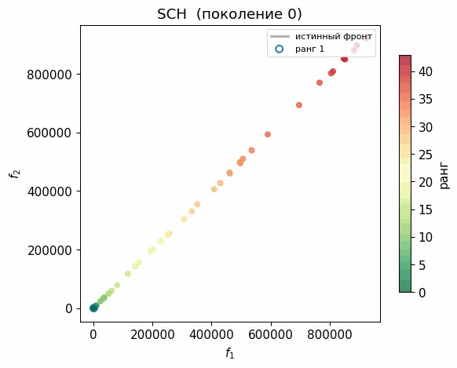
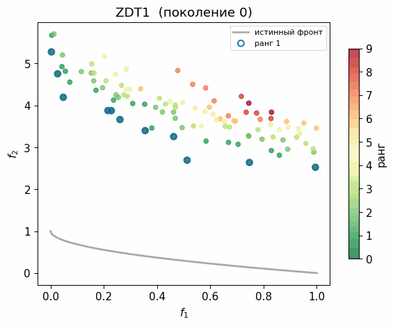
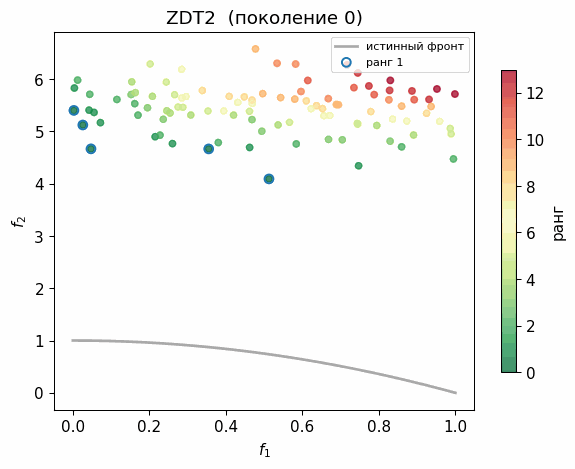
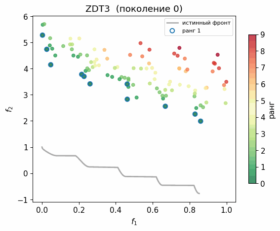

# NSGA-II — доклад по Численным методам

Доклад прочитан 25 апреля 2026 года на курсе **Численные методы** (Университет ИТМО, Институт математики).

**Тема:** Быстрый элитарный многокритериальный генетический алгоритм NSGA-II  
**Автор:** Ластовецкий Дмитрий  
**Источник:** K. Deb, A. Pratap, S. Agarwal, T. Meyarivan — *A Fast and Elitist Multiobjective Genetic Algorithm: NSGA-II*, IEEE TEC, 2002

---

## Файлы

| Файл | Описание |
| --- | --- |
| `slides.pdf` | Слайды доклада |
| `tex/slides.tex` | Исходник слайдов (XeLaTeX + Beamer) |
| `src/nsga2_core.py` | Ядро алгоритма |
| `notebooks/nsga2_demo.ipynb` | Демонстрационный ноутбук |
| `scripts/generate_assets.py` | Генерация графиков и анимаций |

---

## Ключевые результаты

### Три нововведения NSGA-II

| Проблема NSGA | Решение NSGA-II |
| --- | --- |
| Сортировка $O(MN^3)$ | Быстрая недоминируемая сортировка $O(MN^2)$ |
| Нет элитизма: хорошие точки теряются | Объединение $R_t = P_t \cup Q_t$, отбор лучших $N$ |
| Параметр ниширования $\sigma_\text{share}$ требует ручной настройки | Расстояние толпы без параметров |

При $N = 100$, $M = 2$: быстрая сортировка даёт $\approx 20\,000$ операций против $\approx 2\,000\,000$ у NSGA.

### Оператор $\prec_n$

Единый критерий сравнения двух особей:

$$i \prec_n j \iff \begin{cases} i_\text{rank} < j_\text{rank} \\ i_\text{rank} = j_\text{rank} \land\; i_\text{dist} > j_\text{dist} \end{cases}$$

Используется в бинарном турнире и при заполнении граничного фронта.

### Метрики на задачах ZDT ($N = 100$, $T = 250$)

| Задача | $\Upsilon$ (сходимость) | $\Delta$ (равномерность) |
| --- | --- | --- |
| SCH | 0.076 | 0.808 |
| ZDT1 | 0.0050 | 0.357 |
| ZDT2 | 0.0048 | 0.364 |
| ZDT3 | 0.0048 | 0.540 |

$\Upsilon \to 0$ — найденный фронт совпадает с истинным. $\Delta \to 0$ — точки распределены равномерно.

По данным оригинальной статьи NSGA-II превосходит SPEA и PAES: лучше по $\Upsilon$ в 7 из 9 задач и по $\Delta$ во всех 9 — без ручного подбора параметров разнообразия.

### Что гарантировано

- **Монотонность**: лучшее найденное решение не ухудшается от поколения к поколению.
- **Вероятностная сходимость**: при достаточном числе поколений алгоритм с высокой вероятностью находит хорошее приближение к фронту Парето.
- **Не гарантировано**: точное нахождение всего фронта Парето; результаты разных запусков могут различаться (алгоритм стохастический).

---

## Анимации

### SCH (Schaffer) — простой выпуклый фронт

### ZDT1 — выпуклый фронт (n=30, N=100, T=250)

### ZDT2 — невыпуклый фронт (n=30, N=100, T=250)

### ZDT3 — разрывный фронт, 5 кусков (n=30, N=100, T=250)

Цвет точек соответствует рангу недоминируемости: синий — ранг 1 (лучшие), красный — хуже.
